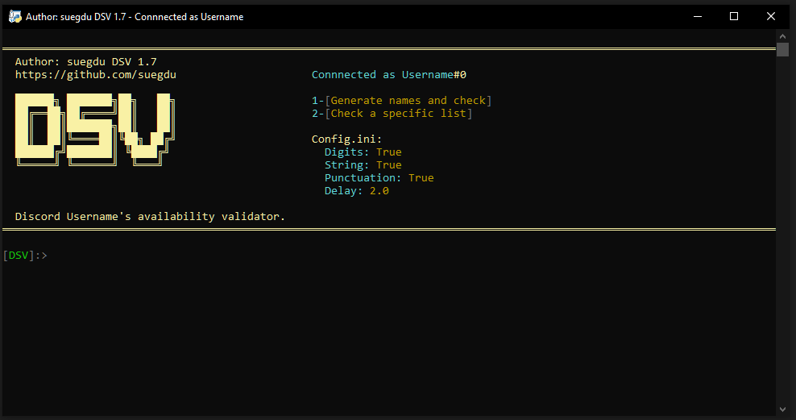
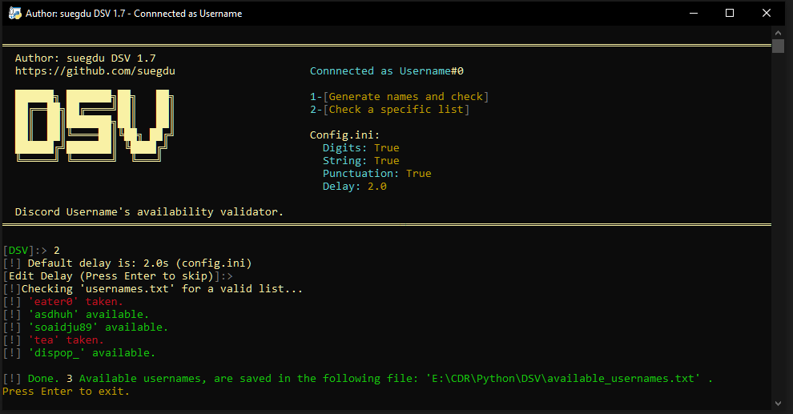
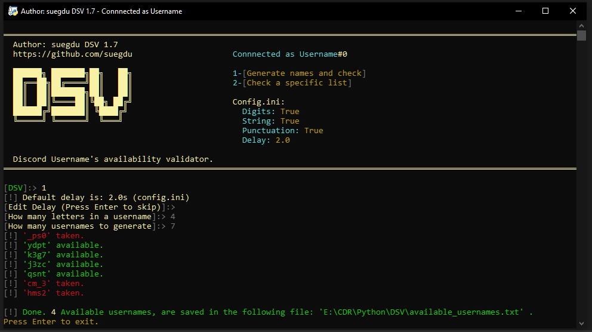

# DSV Version Francaise
ORIGINAL DEV OF THIS TOOL : https://github.com/suegdu/Discord-Username-Checker
DEV ORIGINAL DU TOOL : ^
#### Pour les contributions et mise a jour : <a href="https://discord.gg/Bww4DvKA4Z">Join the Discord</a>
---
- Check une liste spécifique de mots pour voir espérer trouver des noms valides.
- Génère et vérifie un nombre donné de noms d'utilisateurs avec une longueur de nom d'utilisateur spécifique, (ex : 4 lettres nom d'utilisateur.)
- ajout du  Multi-Tokens. (vous pouvez mettre autant de token que possible QUI MARCHE dans le dossiers tokens.txt pour ne pas avoir le ratelimite ou moins vite)
- Entièrement personnalisable.
- PS : le ratelimite ne provient pas du tool, ceci provient de discord depuis une mise à jour récent qui limite le nombre de check par token.

> - Pas de proxy ? les proxys ne contournent pas le ratelimite donc ça ne sert à rien mais je l'ajouterai quand même as l'avenir.

 > Check <a href =#notes >notes</a> pour une information très importante avant d'utiliser cet outil, et pour quelques FAQ. Et AVANT d'ouvrir une issue.

# Comment ca marche ?
- Have <a href="https://www.python.org/">Python</a> d'installer.
- Commencez par cloner le fichier ou <a href="https://github.com/suegdu/DSV/archive/refs/heads/main.zip"> télécharger le en .zip</a>
- nstallez les bibliothèques requises en exécutant : ```pip install -r requirements.txt``` or `pip3 install -r requirements.txt` dans ton cmd.
- Ouvre `config.ini`
- Collez le TOKEN de votre compte devant le symbole égal `TOKEN`
- Configure DSV comme tu veux (`config.ini`)
- Run `dsv.py` 

> - Pour ajouter une liste spécifique de noms d'utilisateur, crée un ficher au nom de `usernames.txt` dans le endroit que `dsv.py` et ajoute tout les noms que tu veux comme les exemples dans le fichier.
> - Pour ajouter des tokens multiples, ouvre `config.ini` et active `MULTI-TOKEN` en remplacent false par `true` et colle tes tokens dans `tokens.txt` comme indiquer dans le fichier.

- #### Note: Cela ne fonctionnera qu'avec les comptes qui n'ont pas procédé à l'application du changement de nom et qui ont la fenêtre contextuelle à mettre à jour (Ex: crée un comtpe secondaire.). Lis <a href =#notes >Notes</a> pour connaitre pourquoi.

# Images




# Notes
#### Disclaimer: je ne suis pas responsable de/de tout dommage/résultats/retours/suspension fait/résulté avec/par cet outil. Tu accepte de le lance, tu accepte que les risques te reviennent.


> ### En raison de changements récents dans l'API de Discord, Discord a ajouté des exigences CAPTCHA. Cela ne fonctionnera qu'avec un compte qui n'a pas procédé à l'application du changement de nom et qui a la fenêtre contextuelle à mettre à jour.

- I **demand** my credits to the code wherever it's used.
- Le spam de L'API Discord est contre les TOS, vous pouvez voir votre compte suspendu et je ne suis pas responsable. Pour une mise en garde supplémentaire, utilisez un token d'un compte secondaire qui ne vous sert a rien et un délai plus long.
- Vous devez obtenir le TOKEN de votre compte Discord et le coller dans la variable :`TOKEN` . Sur la façon de procéder, vérifiez ces étapes suivantes : https://www.androidauthority.com/get-discord-token-3149920/
<!-- (old)- Your account must receive the <a href="https://discord.com/blog/usernames">name change update</a> to use this tool or else you may face some bugs or an invalid continuation of an `Available` username.-->

<!-- (old)- If you kept getting an `Available` username message despite it being taken, that means you have either reached the limit (***API***) or your account didn't receive the update.-->
- Ne met pas de délai de merde sinon ton compte sera désactivé. 
<!-- - > #### This is a very early and LIMITED build you may face some bugs, unknown bugs. It may not work for you and work for some. But with your informing help, we can make it better. <a href="https://github.com/suegdu/DSV/issues/new">Open an issue here</a>. -->


**Support**: <a href="https://www.paypal.com/paypalme/suegdu">Paypal</a>
